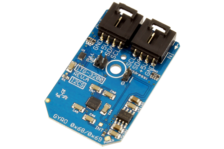

[](https://www.controleverything.com/content/Gyro?sku=ITG-3200_I2CS)
# ITG-3200
ITG-3200 Gyro Angular Rate Sensor

The ITG-3200 provides 3-Axis Digital Gyrometer using I²C communications.

This Device is available from ControlEverything.com [SKU: ITG-3200_I2CS]

https://www.controleverything.com/content/Gyro?sku=ITG-3200_I2CS

This Sample code can be used with Raspberry pi.

##Java 
Download and install pi4j library on Raspberry pi. Steps to install pi4j are provided at:

http://pi4j.com/install.html

Download (or git pull) the code in pi.

Compile the java program.
```cpp
$> pi4j ITG3200.java
```

Run the java program as.
```cpp
$> pi4j ITG3200
```

##Python 
Download and install smbus library on Raspberry pi. Steps to install smbus are provided at:

https://pypi.python.org/pypi/smbus-cffi/0.5.1

Download (or git pull) the code in pi. Run the program

```cpp
$> python ITG3200.py
```

The code output is the raw values of angular acceleration in X, Y and Z axis.
